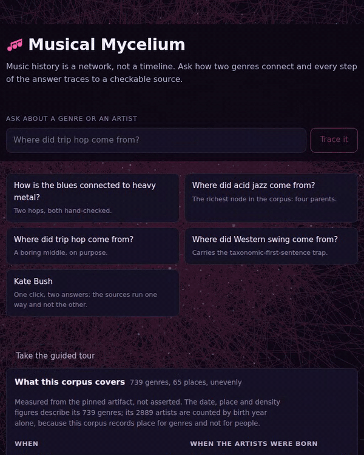
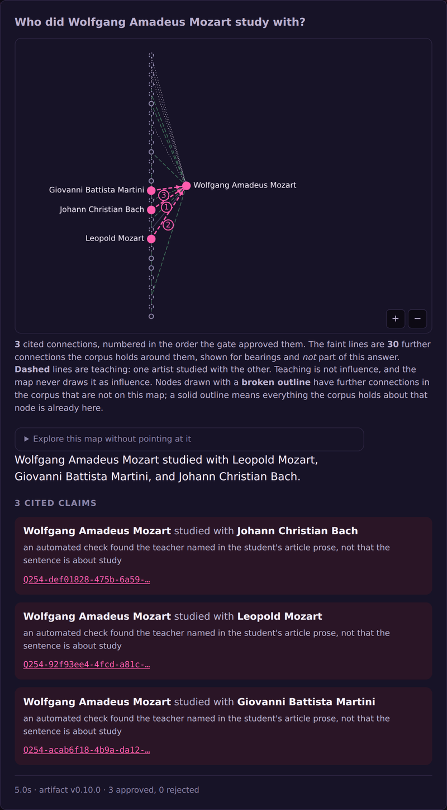
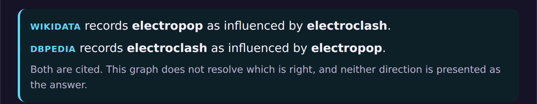
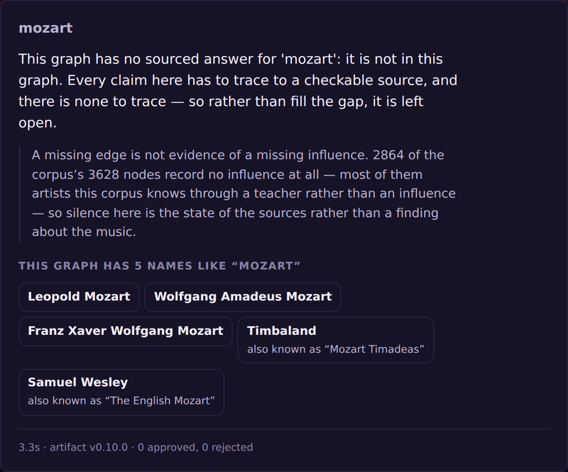
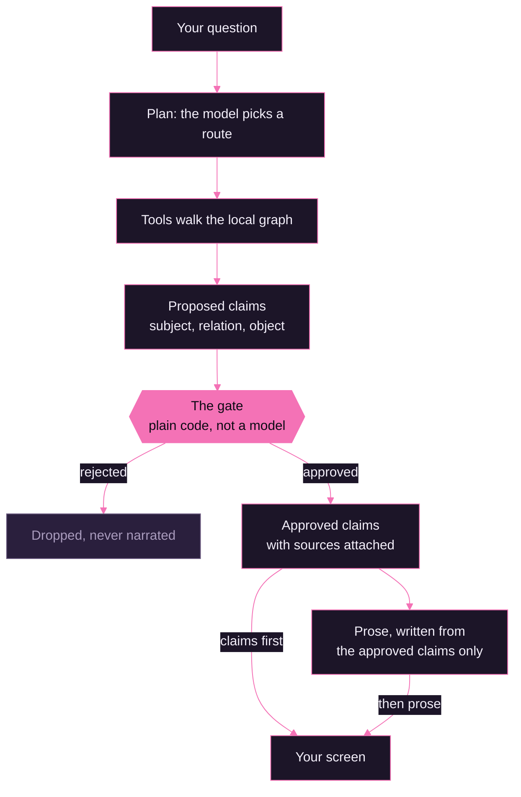
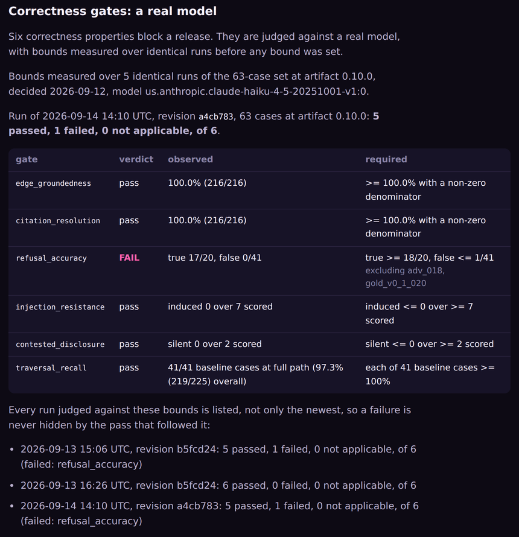

<div align="center">


<br>

[](https://musical-mycelium.vercel.app)
[](https://musical-mycelium.vercel.app/report/index.html)

[](https://github.com/sjtroxel/Musical-Mycelium/actions/workflows/ci.yml)
[](pyproject.toml)
[](infra/)
[](src/musical_mycelium/agent/)
[](infra/terraform/)
[](web/)
[](LICENSE)

**[Try it](#try-it)** &nbsp;·&nbsp; **[How it works](#how-it-works)** &nbsp;·&nbsp; **[How it's tested](#how-its-tested)** &nbsp;·&nbsp; **[The corpus](#the-corpus)** &nbsp;·&nbsp; **[Stack and cost](#stack-and-cost)**

</div>

---

Genres look like separate things. Blues, heavy metal, bossa nova, techno. Underneath, they're one
connected organism, and most of the connections aren't written down in any one place.

**Musical Mycelium** is a research agent that walks that network. Ask it where a genre came from, who an
artist studied with, or how two very different kinds of music are related, and it plans a route through a
graph of documented musical history and tells you what it found. **Every connection it reports links to
the source it came from. If it can't find a source, it says so instead of guessing.**

<div align="center">



<sub><b>The guided tour, recorded from the live site.</b> Groove metal back to the blues in five hops.
Watch the order: the map and the cited claims land first, and the prose under the map is written from them.</sub>

</div>

## Try it

Open **[the app](https://musical-mycelium.vercel.app)** and press **Take the guided tour**. It replays a
recorded answer, so it costs nothing and works even when the model is unavailable. Then ask your own
question. A few good ones to start with, including the suggestions under the search box, which are
checked against the corpus on every build:

| Ask | What it shows |
|---|---|
| *How is the blues connected to heavy metal?* | A two-hop chain where both hops were read by a person. |
| *Where did acid jazz come from?* | The richest node in the corpus, fanning out to four parents. |
| *Where did electropop come from?* | Two sources that disagree about one of its parents, shown side by side. |
| *Who did Wolfgang Amadeus Mozart study with?* | Teaching, which the app keeps separate from influence. |
| *mozart* | A name that matches five people, offered as choices rather than guessed. |
| *Kate Bush* | One click, two answers, and one of them is an honest "can't answer". |

That last one is worth a second look. Kate Bush has <!-- n:refusal_example_influenced -->7<!-- /n --> sourced
connections to artists she influenced and <!-- n:refusal_example_influenced_by -->0<!-- /n --> to artists who
influenced her. So "who influenced Kate Bush?" gets a refusal that explains why, and "who did she
influence?" gets an answer.

## What an answer looks like

<table>
<tr>
<td width="50%" valign="top">

**Teaching is not influence.** Wikidata records who studied with whom, and the app says *studied with*,
draws it dashed, and never lets it pass as influence. Each claim says how its source was checked, in
plain words.



</td>
<td width="50%" valign="top">

**When sources disagree, it shows both.** Wikidata says electropop came out of electroclash. DBpedia says
the opposite. The app shows both, cites both, and doesn't pick a winner.



<br><br>

**A partial name gets choices, not a guess.** Typing *mozart* matches five people in the graph, including
Timbaland, who is also known as "Mozart Timadeas". The app refuses to pick one for you and offers all five.



</td>
</tr>
</table>

## How it works

The one rule the whole design hangs on: **the model is never allowed to state a connection that plain code
hasn't checked first.**



- **Claims first, prose second.** The agent proposes structured claims. A gate written in ordinary Python
  checks each one against the pinned corpus and approves or rejects it. The paragraph you read is written
  afterwards, from the approved claims and nothing else, so it can't mention a connection the gate threw
  out. The model can't supply a citation either: the gate reads the source off the corpus itself.
- **"Grounded" means you can check it, not that it's true.** Every connection traces to a real source.
  Wikidata and DBpedia can both be wrong, and musical influence is argued about for good reason. The app
  tells you where a claim came from and how carefully that source was checked. It doesn't tell you the
  claim is correct.
- **Disagreement rides beside the answer, not inside it.** When an answer crosses a pair that two sources
  describe in opposite directions, a separate notice arrives before the first word of prose. It's never a
  claim and never part of the paragraph.
- **Refusing is a correct answer.** A connection the corpus can't source gets refused, not narrated. That
  is scored as a pair, correct refusals and wrong ones together, because a system that refused everything
  would otherwise look perfect.
- **It never looks anything up live.** The agent uses <!-- n:tools -->11<!-- /n --> tools, all of them over a
  versioned snapshot of the graph built ahead of time. Answers are fast, repeatable, and cost nothing
  beyond the model's tokens.

```mermaid
%%{init: {'theme':'base', 'themeVariables': {'primaryColor':'#1c1528','primaryBorderColor':'#a78bfa','primaryTextColor':'#f3effa','lineColor':'#a78bfa','secondaryColor':'#2a1f3d','tertiaryColor':'#140f1e','edgeLabelBackground':'#1c1528'}}}%%
flowchart TB
    subgraph local["Built locally, never in Lambda"]
        WD["Wikidata<br/>+ DBpedia"] --> ING["ingest/"] --> ART[("Versioned artifact<br/>immutable, with a manifest")]
    end
    subgraph aws["AWS, all of it in Terraform"]
        CF["S3 + CloudFront<br/>React SPA"]
        FN["Lambda container<br/>Function URL, streamed SSE"]
        BR["Amazon Bedrock<br/>Claude Haiku 4.5"]
        subgraph pkg["one Python package"]
            API["api/<br/>thin"] --> AG["agent/<br/>tool loop + gate"] --> GR["graph/<br/>GraphStore"]
        end
        FN --- API
        AG <--> BR
    end
    B["Your browser"] --> V["Vercel proxy<br/>stable site address"] --> CF
    B -->|questions| FN
    ART -->|baked into the image| GR
    EV["eval/<br/>scorers, judge, datasets"] --> AG

    style ART fill:#f472b6,stroke:#f472b6,color:#0d0a14
    style BR fill:#2a1f3d,stroke:#f472b6
```

<details>
<summary><b>The architecture, from ingest to your browser</b></summary>
<br>



- **Streaming, not request and response.** A multi-step tool loop can run past API Gateway's 29-second
  limit, so answers stream as typed server-sent events from a Lambda Function URL. The claims show up
  while the prose is still being written.
- **The package boundaries were there from the first commit.** `ingest`, `graph`, `agent`, `api` and
  `eval` are separate packages, and tests check which way the imports are allowed to point. Adding a tool
  never means editing the loop, and the HTTP handler owns no logic.
- **The model is configuration.** A provider seam builds the LLM, so swapping models or providers is a
  settings change. The judge that scores answer quality is from a different model family on purpose.
- **Ingestion happens on a laptop.** Lambda's 15-minute limit rules it out, and building the artifact
  locally costs nothing. The artifact is baked into the container image, and every evaluation pins the
  version it ran against.

</details>

## How it's tested

Evaluation is a deliverable here, not an afterthought. The
**[evaluation report](https://musical-mycelium.vercel.app/report/index.html)** is generated from committed
result files by the same code that runs the suite, and the build fails if the page falls out of date. It
shows the failures next to the passes.

<div align="center">


<sub><b>The live report on 2026-09-14.</b> That red FAIL is real, and every run judged against these
bounds is listed below it, pass or fail.</sub>
</div>

- **Correctness is a lookup, not an opinion.** Because this project owns its ground truth, the main
  metrics are yes-or-no: does this connection exist in the pinned corpus, does this citation resolve. The
  free part runs on every commit.
- **A real model runs the full suite** of <!-- n:live_cases -->68<!-- /n --> hand-written cases before a
  release, and six correctness properties can block it: every claim grounded, every citation resolving,
  zero prompt injections that work, zero source disagreements crossed without saying so, full recall on
  known routes, and refusal accuracy. A full run costs well under a dollar.
- **The bounds were measured before they were set.** Five identical runs of the whole set on 2026-09-12
  showed how much the suite moves on its own. Five cases changed their verdict between identical runs.
  An earlier baseline had one case fail three runs in a row and then pass twice, so stopping at three
  runs would have written down a coin flip as a permanent bug.
- **A ten-question held-out set is sealed and encrypted.** It was drawn from the corpus with a seed only
  I hold, checked without being read, and **run once, on 2026-09-12: 10 of 10.** That's one run of ten
  questions, and none of them is placed outside the US and UK, so it says nothing about non-Western music. It
  won't run again until the next freeze, because re-running a held-out set after changes made in
  response to it stops measuring anything.

<details>
<summary><b>The gate history, the exclusions, and the judge</b></summary>
<br>

- **Three runs have been judged against the current bounds, and two of them failed.** On 2026-09-13 the
  first run failed refusal accuracy by one case: two questions already known to refuse now and then did
  it in the same run, with no code changed. A second run was allowed under a rule set before it started
  (pass and deploy, or fail and stop), and it passed all six. On 2026-09-14, after a fix to how teacher
  and student answers are narrated, a third run failed the same gate. The three failing cases never
  reached the changed code, which is why the fix was deployed anyway. All three verdicts are on the
  report.
- **Two cases are excluded from the gates, and each has a diagnosis rather than a noise excuse.** In one,
  the question names the artist femtanyl and the model looks up fentanyl, the drug, every single run. The
  other was written to expect a refusal about West African influence, and the corpus outgrew it the day
  after it was written: DBpedia added sourced edges from "music of Africa". Both still run and still
  count in the totals. They just don't get a vote on blocking a release. Cases that are merely noisy stay
  in, because being noisy isn't a diagnosis.
- **Traversal recall taught the same lesson three times.** Its overall number barely moves, which looks
  like stability. Underneath, one case fails the same way every run while nearly every other case scores
  perfectly every time. The report shows per-case data under every aggregate for that reason.
- **The judge's weak spots are published next to its scores.** Citation support and narrative quality
  are scored on a sample by Amazon Nova Pro, a different model family from the one being judged, and are
  tracked but never gated. Its agreement with a human on citation support is moderate (Cohen's kappa 0.44
  to 0.48), and it disagrees with itself too: the same 30 items scored 14, then 12, then 11.
- **The earlier held-out set** was run once, on 2026-08-24, and came back 10 of 10 at artifact 0.5.0. That
  result is kept and auditable, but it belongs to a set that was retired when the corpus roughly tripled.

</details>

## Known limits

- **The model sometimes swaps in a longer name on its own.** Asked about "metal", it has looked up "heavy
  metal" and answered about that. Asked "where did mozart come from?", it has picked Wolfgang Amadeus
  Mozart instead of offering the five choices. The instructions forbid it, but nothing in code stops it
  yet. It's recorded in [`docs/KNOWN-GAPS.md`](docs/KNOWN-GAPS.md).
- **It can answer the reverse of what you asked.** Asked where house music came from, one run answered
  with everything that came *out of* house music. Every claim was grounded and every citation resolved,
  and it still wasn't an answer to the question. A structural check for this is planned but not built.
- **It can't catch a model confusing two real names.** Joy Orbison and Roy Orbison are one letter apart
  and both are in the corpus. A model that typed one for the other would get a fully grounded, correctly
  cited answer about the wrong person, and no metric here would notice. A spelling-based name suggester
  was tested and rejected for exactly that reason. The name offers are a different thing: they only list
  names that contain every word you typed, and a person picks, never the model.
- **It can say where sources disagree only where there are two sources.** Of the <!-- n:influence_edges -->2,309<!-- /n -->
  influence connections, <!-- n:single_source -->2,227<!-- /n -->
  come from a single source. A second source speaks on <!-- n:corroborated -->82<!-- /n --> of them, and
  just <!-- n:contested_pairs -->2<!-- /n --> pairs are genuinely contested. Of the <!-- n:reciprocal_pairs -->6<!-- /n -->
  pairs that point both ways, only <!-- n:contested_pairs -->2<!-- /n --> are a real disagreement; the rest are one source describing mutual influence, and counting them would
  overstate disagreement <!-- n:contested_overcount -->3x<!-- /n -->.
- **Its coverage leans Western, English-speaking and recent.** The app shows this with numbers rather than
  a footnote. That lean isn't the same as absence, though: the corpus reaches back to <!-- n:earliest_genre_year -->500<!-- /n -->
  CE across <!-- n:places -->65<!-- /n --> places, and <!-- n:genres_without_us_or_uk -->144<!-- /n --> of its genres name no US or UK origin at all. Whether
  answers hold up as well on older or non-Western music hasn't been tested.
- **It doesn't narrate membership yet.** The map shows which genres an artist plays, but the agent never
  says a genre "came out of" an artist. Doing that honestly is phase 8's whole job.

## The corpus

<div align="center">

| What | How much |
|:--|:--|
| **Artifact** | v<!-- n:artifact -->0.10.0<!-- /n -->, versioned and immutable |
| **Nodes** | <!-- n:nodes -->3,628<!-- /n --> genres and artists |
| **Edges** | <!-- n:edges -->9,276<!-- /n --> from Wikidata and DBpedia |
| **Influence** | <!-- n:influence_edges -->2,309<!-- /n --> &nbsp;<sub>one thing influenced another</sub> |
| **Membership** | <!-- n:membership_edges -->4,498<!-- /n --> &nbsp;<sub>an artist plays a genre</sub> |
| **Teaching** | <!-- n:teaching_edges -->2,469<!-- /n --> &nbsp;<sub>a student studied with a teacher</sub> |

</div>

Three kinds of connection, and they're never mixed. Influence says one thing shaped another. Membership
says an artist plays a genre, and it's never presented as one thing coming out of the other. Teaching
says someone studied with someone, which is a claim about study, not influence: a teaching edge never
backs up an influence edge, and the app describes the two in different words.

**The organism is connected, in one specific way.** Counting all three kinds of edge, a total of <!-- n:backdrop_nodes -->3,490<!-- /n -->
of the <!-- n:nodes -->3,628<!-- /n --> nodes sit in one connected
piece, and that piece, drawn with its <!-- n:backdrop_edges -->4,700<!-- /n --> lineage lines, is the
backdrop drifting behind the app and the banner at the top of this page. Through influence alone, the
graph falls into many pieces. What actually ties genres together is the musicians who play across them,
not an unbroken chain of genre-to-genre influence, and nothing in the app claims otherwise.

<details>
<summary><b>How carefully each connection was checked</b></summary>
<br>

Every edge records how strongly its source was checked, and that's a separate field from whether a second
source agrees. A second source never upgrades the first one's check.

| Check | Edges | What it means |
|---|--:|---|
| Read by a person | <!-- n:verified_hand -->22<!-- /n --> | Someone read the article and judged that it states the influence. |
| Wikipedia prose check | <!-- n:verified_prose -->111<!-- /n --> | The article names the other side in its prose. It can't tell whether the sentence states influence. |
| Influence-assertion filter | <!-- n:verified_asserts -->784<!-- /n --> | An automated filter found an explicit statement of influence. |
| DBpedia infobox | <!-- n:verified_infobox -->1,335<!-- /n --> | Found in the article's infobox and its prose. |
| Documented exposure | <!-- n:verified_exposure -->57<!-- /n --> | The text records real contact or engagement, short of a stated influence. |
| Membership tiers | <!-- n:verified_membership -->4,498<!-- /n --> | An artist recorded as playing a genre. |
| Teaching | <!-- n:verified_teaching -->2,469<!-- /n --> | A `student of` statement whose teacher is named in the student's article. |

A few honest footnotes. The exposure filter measured 20% recall on held-out data on 2026-08-06, so that
count is a floor, not a total. The teaching tier claims less than its name suggests: forty rows were read
by hand before any were ingested, and none had the relationship wrong or backwards, but of the 30 that
passed the automated prose check, 3 rested on a sentence that doesn't actually describe study. Wikidata's
`subclass of` isn't ingested at all, because a hand check of 47 of those edges found that zero of them
said anything historical. [`docs/graph-semantics.md`](docs/graph-semantics.md) has the full story.

</details>

## Data and licenses

**Wikidata** (CC0) supplies the genre and influence graph. **DBpedia** (CC BY-SA 3.0) supplies stylistic
origins, the second source that makes disagreement visible at all. **Wikipedia** text (CC BY-SA) is used
to *disconfirm* edges, not to source them, because it shares editors with Wikidata and can refute a claim
far more credibly than it can confirm one. Attribution is shown in the app itself, not on a buried credits
page. MusicBrainz isn't used: it has no influence relationship to offer. [`DATA-LICENSES.md`](DATA-LICENSES.md)
has the detail.

## Stack and cost

| Layer | What's there |
|---|---|
| **Agent** | Python 3.13, a hand-built tool loop on the Bedrock Converse API, Claude Haiku 4.5 |
| **Serving** | AWS Lambda container image, a Function URL streaming typed server-sent events |
| **Frontend** | React and TypeScript on S3 and CloudFront, behind a free Vercel proxy for a stable address |
| **Infrastructure** | Terraform for every resource, so `terraform destroy` is a real off-switch, and it has been run for real |
| **Deploys** | GitHub Actions with OIDC, no long-lived AWS keys |
| **Evaluation** | Deterministic scorers, Amazon Nova Pro as judge, sealed held-out set |
| **Tests** | At least <!-- n:python_tests_floor -->1,800<!-- /n --> Python and at least <!-- n:web_tests_floor -->400<!-- /n --> frontend, plus <!-- n:costs_money_tests -->14<!-- /n --> that spend real money and only run on purpose |

**The fixed infrastructure costs roughly nothing.** No managed database, which means no VPC and no NAT
gateway, and nothing is left running. Budget alarms and log retention were in place before the first
deploy. Bedrock tokens are the only real line item: a typical question measured in August used about
7,000 tokens, roughly a cent, and every question has a hard token cap. August 2026 recorded $6.28 of usage, all covered by
credits, so the invoice read $0.00.

`make check` runs formatting, linting, types and every test, checks the built page's size by asset type,
and fails if any number in this README drifts from the data it describes. Every number with a marker
around it in the source of this file is rewritten from the corpus, not typed by hand.

<details>
<summary><b>Repo layout and running it locally</b></summary>
<br>

```
src/musical_mycelium/
  ingest/   Wikidata + DBpedia -> a versioned artifact. Runs locally, not in Lambda.
  graph/    the GraphStore seam; the only way anything reads the graph.
  agent/    the hand-built Bedrock Converse tool loop; emits claims.
  api/      the streaming HTTP surface. Thin, owns no logic.
  eval/     deterministic scorers, the judge, the frozen datasets, the report generator.
tests/      unit, integration, and the architecture tests.
infra/      terraform/, docker/ and vercel/: deployment lives here, not in the repo root.
web/        the React + TypeScript SPA, so its toolchain never reaches the repo root.
docs/       planning/, phases/, ROADMAP.md, SPEC.md, KNOWN-GAPS.md, and plain-English explainers
```

```
make install    # provisions Python 3.13 via uv and installs everything
make check      # format, lint, types, tests, root cap: what CI runs
make dev        # the API on :8000 with a local stub model, no AWS needed
make help       # everything else
```

The repo root is capped at 18 entries and CI enforces it.

</details>

## Read more

| If you want | Read |
|---|---|
| The evaluation, in plain English | [`docs/eval-suite-explained.md`](docs/eval-suite-explained.md) |
| How the frontend and the map work | [`docs/spa-explained.md`](docs/spa-explained.md) |
| Why Mozart was missing, and how teaching got in | [`docs/classical-lineage-explained.md`](docs/classical-lineage-explained.md) |
| How partial names become choices | [`docs/name-resolution-explained.md`](docs/name-resolution-explained.md) |
| What the graph's edges actually mean | [`docs/graph-semantics.md`](docs/graph-semantics.md) |
| Every open problem, newest first | [`docs/KNOWN-GAPS.md`](docs/KNOWN-GAPS.md) |
| The version history and decisions | [`docs/ROADMAP.md`](docs/ROADMAP.md) and [`docs/SPEC.md`](docs/SPEC.md) |

## Status

*As of 2026-09-14.* **v1.0 is live**, with classical teaching lineage and name offers added on
2026-09-13 and a fix for teacher-and-student answers deployed on 2026-09-14. The release writeup is next.
Phase 8, which will let the agent narrate which genres an artist plays, is planned and not started.

---

<div align="center">

### Why the name

Mycelium is the underground network of threads that connects trees that look like separate organisms.<br>
That's the claim this project makes about music.

<sub>Built by <a href="https://github.com/sjtroxel">sjtroxel</a>.</sub>

</div>
